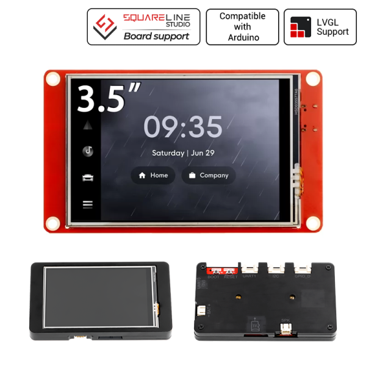
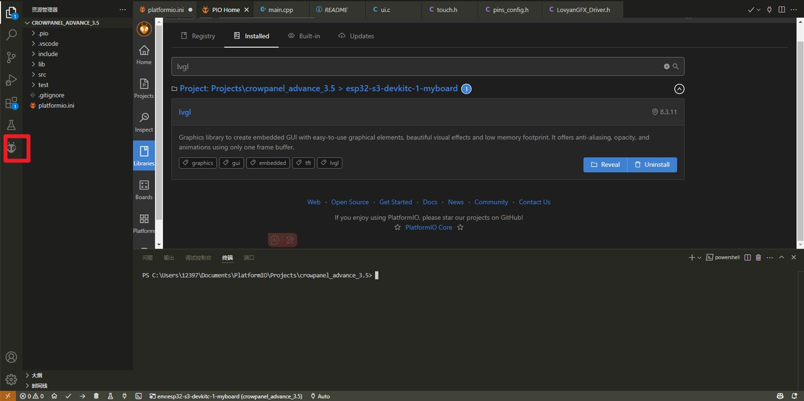
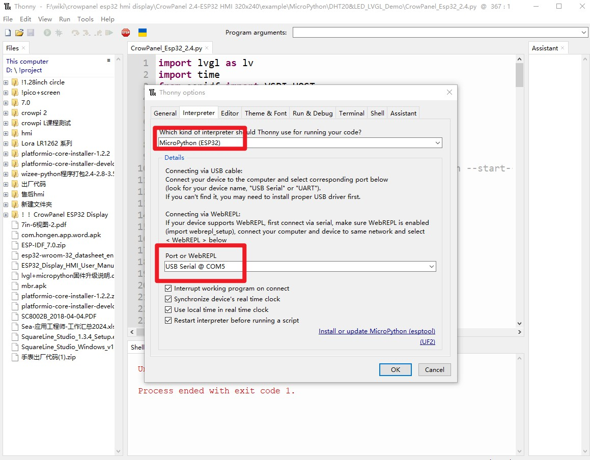

1, Product picture

2, Product version number

|      | Hardware | Software | Remark |
| ---- | -------- | -------- | ------ |
| 1    | V2.2     | V1.0     | latest |

3, product information

- Model: 3.5 inches module-CrowPanel ESP32 display
- Main Processor: ESP32-WROVER-B
- Resolution: 480*320
- Touch Type: Resistive Touch Screen
- Display Type: TN Panel
- Screen: TFT-LCD Screen
- Display driver: ILI9488
- External power supply: DC5V-2A
- Interface: 1*TF Card Slot, 1* I2C, 1* GPIO, 1*Speak, 1* UART1, 1*UART0
- Button: BOOT Button and Reset Button
- Active Area: 48.96*73.44mm(W*H)
- Working Temperature: -20℃～70℃
- Storage Temperature: -30℃～80℃

4, Use the driver module

| Name | dependency library |
| ---- | ------------------ |
| LVGL | lvgl/lvgl@8.3.3    |

5,Quick Start

##### Arduino IDE starts

1.Download the library files used by this product to the 'libraries' folder.

C:\Users\Documents\Arduino\libraries\

2.Open the Arduino IDE

3.Open the code configuration environment and burn it

##### ESP-IDF starts

1.Right-click on an empty space in the project folder and select "Open with VS Code" to open the project.

2.In the IDF plug-in, select the port, then compile and flash

##### PlatformIO starts

1.Right-click on an empty space in the project folder and select "Open with VS Code" to open the project.

2.In the PlatformIO plug-in, select the port, then compile and flash

##### Micropython starts

1,Right-click on an empty space in the project folder and select "Thonny" to open the project.

2,In thonny software, select the master and port, then run the program

6,Folder structure.

|--3D file： Contains 3D model files (.stp) for the hardware. These files can be used for visualization, enclosure design, or integration into CAD software.

|--Datasheet: Includes datasheets for components used in the project, providing detailed specifications, electrical characteristics, and pin configurations.

|--Eagle_SCH&PCB: Contains **Eagle CAD** schematic (`.sch`) and PCB layout (`.brd`) files. These are used for circuit design and PCB manufacturing.

|--example: Provides example code and projects to demonstrate how to use the hardware and libraries. These examples help users get started quickly.

|--factory_firmware: Stores pre-compiled factory firmware that can be directly flashed onto the device. This ensures the device runs the default functionality.

|--factory_sourcecode: Contains the source code for the factory firmware, allowing users to modify and rebuild the firmware as needed.

7,Pin definition

\#define TFT_MISO 12 

#define TFT_MOSI 13 // In some display driver board, it might be written as "SDA" and so on. 

#define TFT_SCLK 14 

#define TFT_CS   15  // Chip select control pin 

#define TFT_DC   2  // Data Command control pin 

#define TFT_RST  -1  // Reset pin (could connect to Arduino RESET pin) 

#define TFT_BL   27  // LED back-light 

#define TOUCH_CS 33     // Chip select pin (T_CS) of touch screen

For the latest v2.2 board, the following modifications need to be made:

#define TFT_MISO 33

#define TOUCH_CS 12`
